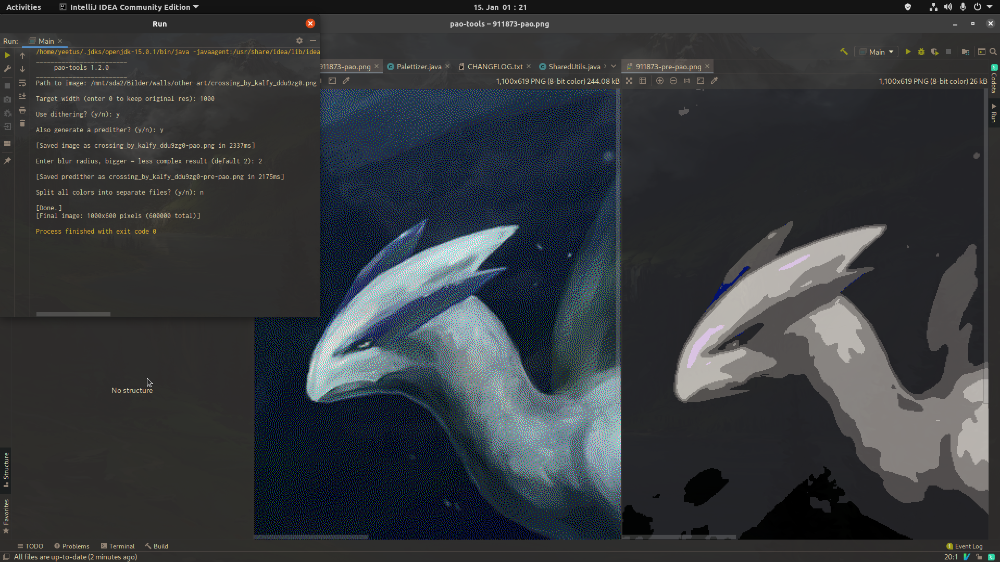

# pao-tools

For the two remaining pixelanarchy players among us.



## Notice
Sadly, the game is no more. I'm leaving this repo online, but you won't need it for its originally intended purpose.

## Tools

- Converting images to the PAO color palette
- Floyd-Steinberg dithering
- Scaling images down
- Splitting images by their colors
- Generating proper predither images using a box blur algorithm

## Usage

This program requires Java 15 and offers no graphical interface. As of now, you have to use the interactive CLI.

1. Make sure you have JRE / JDK 15 installed. Check with the command ```java --version```.

If it shows an older version, then install the ```jdk-openjdk``` package in Linux. Windows users may get it from https://adoptopenjdk.net/releases.html?variant=openjdk15&jvmVariant=hotspot

2. In a terminal, cd to the directory where the jar file is located and type ```java -jar pao-tools*.jar```

3. Follow the instructions, should be self-explanatory. Paths can be relative (e.g. "image.png") or direct (e.g. "/home/user/image.png")

## Quick explanations

**Path to image**: The full path for the source image (e.g. /home/user/image.png, or Windows-style C:\Users\user\image.png, you get the idea).
Just typing out the filename suffices as well if the file is located in the same directory as the project / the .jar file.

**Target width**: How big the image should be in its width. The height will be fittingly calculated to keep the source image's proportions.
You should keep this low enough to not cause you to give up, but high enough to keep the image detailed enough. Experiment around and find your optimal size that does not cause you to lose sanity.

If you think the source image already is small enough, or you just like to see how it would look like, you can input 0 and the original resolution will be kept.

A higher value will cause the processing times to get longer.

**Use dithering**: Dithering can be used to effectively create an illusion of color depth in images using limited color palettes (like in the game pixelanarchy.online, with a color palette that contains 38 colors).

It yields results that are much more similar to the original image thanks to the way we perceive colors, but adds a lot of extra complexity to the result.

If you have chosen not to use dithering, a simple color approximation method is used instead, which gives smoother results. Each color is compared to each individual colour in the color palette and the one closest to it will be picked.

**Also generate a predither**: If you entered "y" in the previous question, you must also decide whether you want a so-called "predither".

A predither image is a smoother, non-dithered version of the final, dithered version. You can draw it first and then dither "over it" to finish the work faster. For each area, the most dominant color is formed, so that as many of the individual pixels as possible are already set correctly.

**Blur radius**: If you have chosen to create a predither, you can select the blur radius that the algorithm should use. The default value is 2.

A larger number will result in a blurrier predither that takes away further detail and colour complexity.

If you have no idea, just input the number 2.

**Split all colors into separate files**: Splitting the colors into separate image files makes your life in the dithering phase a whole lot easier. I highly recommend typing "y" here.

## Build and dev dependencies

Image scaling functionality is based on the [imgscalr 4.2](https://github.com/rkalla/imgscalr) library.
